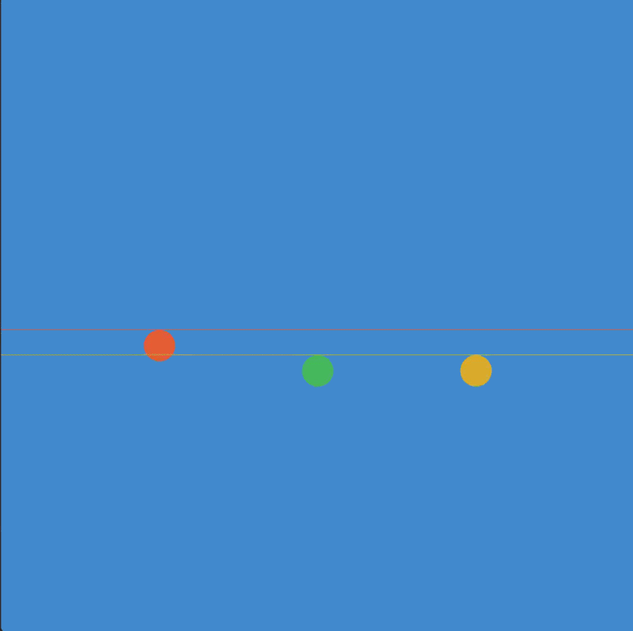

# Physics Integrators Comparison

A C++ / OpenGL project demonstrating the behavior and accuracy of different numerical integration methods in a simple bouncing-ball simulation.

This project compares how three common integration methods simulate motion under gravity and how well they conserve total mechanical energy over time.

## Demo



## Integrators Compared

### Left Ball — Explicit Euler
Simple and fast first-order method.

### Middle Ball — Velocity Verlet
Widely used in physics simulations due to better stability and energy behavior.

### Right Ball — Runge-Kutta 4 (RK4)
Higher-order integration method with excellent accuracy and lowest energy deviation in this test.

---

## What the Program Shows

Each ball starts with identical initial conditions and is simulated using a different numerical integrator.

The simulation displays:

- Ball trajectories in real time
- Height reference lines
- Total mechanical energy printed to terminal

Energy is computed as:

E = kinetic + potential

This allows direct comparison of numerical error accumulation.

---

## Observations

From the simulation results:

- Euler accumulates noticeable energy error fastest
- Velocity Verlet performs significantly better
- RK4 shows the smallest energy drift and highest trajectory accuracy

This matches theoretical expectations.

---

## Technologies Used

- C++
- OpenGL
- GLFW
- GLAD
- GLM

---

## Build & Run

Make sure dependencies are installed:

- GLFW
- GLAD (add glad.c file to your src folder)
- GLM
- OpenGL

Then compile with your preferred compiler.

Example:

```bash
g++ main.cpp -lglfw -ldl -lGL
